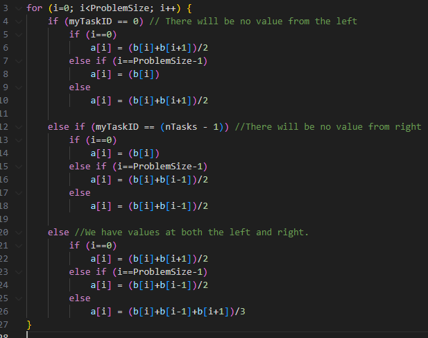
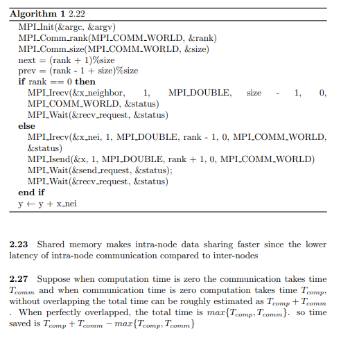

[](https://classroom.github.com/online_ide?assignment_repo_id=13660691&assignment_repo_type=AssignmentRepo)
# Project 2: Getting Started with MPI

## Due: EOD, 9 February

## Learning goals

In this project you will explore using basic MPI collectives on HPCC. After finishing this project, you should

- understand how to parallelize a simple serial code with MPI,
- understand how to use basic MPI collectives,
- be able to run MPI-parallel applications on HPCC,
- develop your theoretical understanding of key parallel computing concepts such as:
  - functional parallelism, 
  - collective communication, 
  - parallel scaling, and 
  - parallel efficiency.

## Part 1: Warm-up Exercises

As a group, complete the following exercises from [HPSC](../assets/EijkhoutIntroToHPC2020.pdf). 

- Exercise 2.18
- - if b and c are modified while the parallel loop is updating a, this could lead to a race condition. 
- - i needs to be a private index variable to each process. If two processors get the same i, they will update the same a, which leads to less than ideal efficiency.
- Exercise 2.19
- - With a size of 1, several of the processes will copies of the same memory locations in their cachelines. When one processor updates the value of this memory location, it invalidates the cachelines of all other processors that also have this memory location in their cachelines. Therefore, maintaining cache coherence requires significant overhead with a small chunksize. The appropriate chunksize would be large enough to fill the cache of one procesor. With this strategy, each processor would have unique memory locations within their individual cache.
- Exercise 2.21 (image below)




Include your responses to these exercises in your project write-up.

## Part 2: Setup on HPCC 

The following is a very quick tutorial on the basics of using HPCC for this class. 

1. Log in to the HPCC gateway:

    ```shell
    ssh <netid>@hpcc.msu.edu
    ```

2. Then log in to the AMD-20 cluster from the gateway:

    ```shell
    module load powertools
    amd20
    ```

3. The default environment and software stack should be sufficient for this exercise, but if you run into issues compiling and running the code try issuing the following commands.

    ```shell
    module purge
    module load intel/2021a
    ``` 

4. When using the HPCC for development and exercises in this class please do NOT just use the head node, `dev-amd20`. We will swamp the node and no one will get anything done. Instead, request an interactive job using the SLURM scheduler. An easy way to do this is to set up an alias command like so:

    ```shell
    alias devjob='salloc -n 4 --time 1:30:00'
    ```

5. Run `devjob`, then to request 4 tasks for 90 minutes. This should be sufficient for most of the stuff we do during class, though for your projects you will at times require more resources. The above `module` and `alias` commands can be added to your `.bashrc` so that they are automatically executed when you log in.

## Part 3: MPI Basics

1. Clone your Project 2 repo from GitHub on HPCC. 

2. In the project directory you will find a simple "Hello World!" source file in C++. Compile and run the code. E.g.,

    ```shell
    g++ hello.cpp
    ./a.out
    ``` 

3. Now run the executable `a.out` using the MPI parallel run command and explain the output:

    ```shell
    mpiexec -n 4 ./a.out 
    ```

4. Add the commands `MPI_Init` and `MPI_Finalize` to your code. Put three different print statements in your code: one before the init, one between init and finalize, and one after the finalize. Recompile and run the executable, both in serial and with `mpiexec`, and explain the output.
 - - each processor outputs the print statements before the initialize statements, between the init and finalize statement, and after the finalize. each processor runs the entire executable, so executes all of the print statements

5. Complete Exercises 2.3, 2.4, and 2.5 in the [Parallel Programing](../assets/EijkhoutParallelProgramming.pdf) book.
- Done, see "ParrallelTextbookQs2.3.cpp", "ParrallelTextbookQs2.4.cpp", and "ParrallelTextbookQs2.5.cpp",

## Part 4: Eat Some Pi 

Pi is the ratio of a circle's circumference to its diameter. As such, the value of pi can be computed as follows. Consider a circle of radius `r` inscribed in a square of side length `r`. Randomly generate points within the square. Determine the number of points in the square that are also in the circle. If `f=nc/ns` is the number of points in the circle divided by the number of points in the square then `pi` can be approximated as `pi ~ 4f`. Note that the more points generated, the better the approximation.

1. Look at the C program `ser_pi_calc`. Extend this program using collective MPI routines to compute `pi` in parallel using the method described above. Feel free to use C++, if you prefer, of course.

2. For the first iteration, perform the same number of "rounds" on each MPI rank. Measure the total runtime using `MPI_WTIME()`. Vary the number of ranks used from 1 to 4. How does the total runtime change?
 - The runtime increases slightly with increasing number of processors, as shown in the figure below. The MPI_Reduce collective requires all processors to finish their threads of execution. In this case, all of the ranks are running the same executable. Therefore, the total parallel calculation can only be as fast as the slowest processor. Also, there is increased communication overhead as more processors are used. For these reasons we can expect the runtime to increase slightly as more processors are added.

3. Now, divide the number of "rounds" up amongst the number of ranks using the appropriate MPI routines to decide how to distribute the work. Again, run the program on 1 to 4 ranks. How does the runtime vary now?
- the runtime now decreases significantly with increasing processor count. To achieve this result, The number of darts was increased to 1e6 for both tests. With lower dart count (such as 1e3), the runtime increased in both Q2 and Q3. This was due to the communication overhead being significantly larger than the computational cost with lower dart count. 


4. Now let's change the number of "darts" and ranks. Use your MPI program to compute `pi` using total numbers of "darts" of 1E3, 1E6, and 1E9\. For each dart count, run your code on HPCC with processor counts of 1, 2, 4, 8, 16, 32, and 64\. Keep track of the resulting value of `pi` and the runtimes. Use non-interactive jobs and modify the `submitjob.sb` script as necessary. 

5. For each processor count, plot the resulting errors in your computed values of `pi` compared to the true value as functions of the number of darts used to compute it. Use log-log scaling on this plot. What is the rate of convergence of your algorithm for computing `pi`? Does this value make sense? Does the error or rate of convergence to the correct answer vary with processor count? Should it? 
   
   Let $N$ be the number of darts thrown. We can define the set of iid Bernoulli random variables, $\{X_n\}_{n=1}^{N}$, to represent the set the set of successful dart throws with success probability $p = \frac{\text{Area of Circle}}{\text{Square}} = \frac{\pi}{4}$. Then the variance of a dart throw is $var(X_n) = \sigma^2 = p(1-p) = \frac{\pi}{4}(1-\frac{\pi}{4})$. Summing over the set of throws, we get a new random variable that follows a Binomial distribution such that $\mathbb{E}(\{X_n\}_{n=1}^{N}) = Np$ and $var(\{X_n\}_{n=1}^{N}) = N\sigma^2$. Assuming a sufficiently large $N$, we can approximate the Binomial distribution as Normal, and thus $\{X_n\}_{n=1}^{N} \sim N(\mu = Np, \text{std} = \sqrt{Np(1-p)})$. We can standardize this distribution by introducing a new equivalent random variable $Z_N = \frac{\sum_{n=1}^{N}X_n - Np}{\sqrt{Np(1-p)}} \sim N(0, 1)$. Now we can construct a confidence interval; any percent will due. Thus, without loss of generality, let us construct a $95%$ confidence interval $\{\mu \pm 3\text{std}\} = \{\pm 3\sqrt{Np(1-p)}\}$. Consider the size of this confidence interval = $|\{\pm 3\sqrt{Np(1-p)}\}| = 6\sqrt{\frac{\pi}{4}(1-\frac{\pi}{4})} \sqrt{N}$. The confidence interval decreases proportionally to $\sqrt{N}$. Therefore, the algorithm converges at a rate of $\sqrt{N}$.
   
   We note that each of these random variables is iid. By the Central Limit Theorem, the errors will converge to a normal distribution.
   
   so we can calculate low order statistical moments by:

   S\[\frac{1}{N}\mathbf{E}[x_n]\]$
   
   Should  which defines variance in the ratio between darts in the circle versus total darts thrown for a single dart as $var(1) = \sigma^2$. Then the variance for $N$ darts can be defined as $var(N) = N^2 \sigma^2$. Thus, the convergence rate of the algorithm is $\frac{var(N)}{var(1)} = N^2$.


6. For each dart count, make a plot of runtime versus processor count. Each line represents a "strong scaling" study for your code. For each dart count, also plot the "ideal" scaling line. Calculate the parallel scaling efficiency of your code for each dart count. Does the parallel performance vary with dart count? Explain your answer. 


7. Going further. Try running your code on different node types on HPCC with varied core counts. In particular, try to ensure that your runs utilize multiple nodes so that the communication network is used. Do you see a change in the communication cost when the job is run on more than one node?

## What to turn-in

To your git project repo, commit your final working code for the above exercises and a concise write-up including responses to the warm-up exercises, performance and accuracy data for your calculations of `pi`, the plots made in Part 4, and detailed responses to the questions posed concerning your results. 
